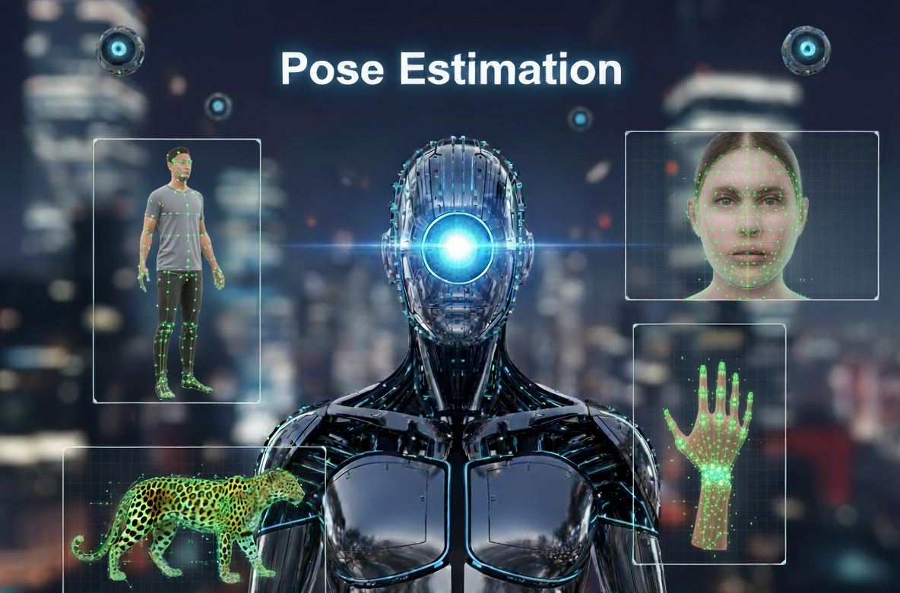
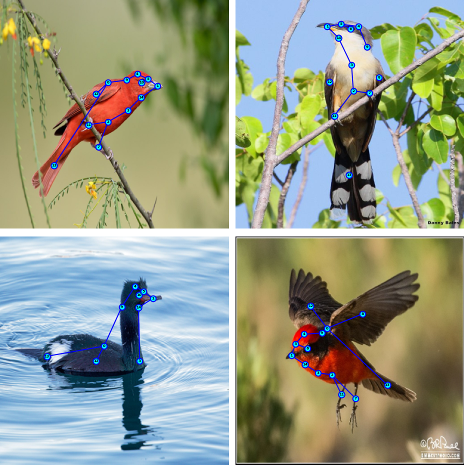
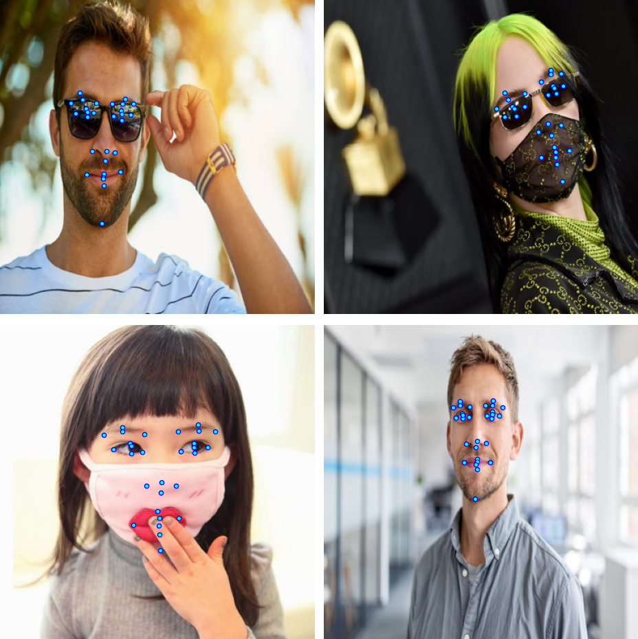

# <h1 align="center">**Pose Estimation**</h1>

 

This repository presents the implementation of several **Pose Estimation** models, a core task in **Computer Vision** that enables machines to infer the position and orientation of humans, animals, or objects in images and videos by identifying specific points, commonly referred to as **keypoints** or **landmarks**. These keypoints can represent joints, limbs, facial features, or other distinctive parts.

Pose estimation methods generally follow two main approaches: **bottom-up** and **top-down**.

* In the **bottom-up** approach, the model first detects all individual keypoints across the entire image using a probabilistic map (**heatmap**) to estimate the likelihood that each pixel corresponds to a specific keypoint. Non-maximum suppression is then applied to select the most confident candidates. This approach is efficient but often less accurate.
* In the **top-down** approach, the model first detects bounding boxes for each instance and then predicts the keypoints within them. This method provides higher accuracy and scale invariance but is computationally expensive, especially as the number of instances increases.

Recent models such as [YOLO11-pose](https://docs.ultralytics.com/tasks/pose/) combine the strengths of both approaches. By avoiding manual grouping and heatmap generation, they retain the efficiency of bottom-up methods, while simultaneously leveraging the precision of top-down pipelines by detecting instances and estimating poses in a single unified process.

## **Current Applications**

Pose estimation has become a cornerstone in multiple domains, including:

* **Healthcare and rehabilitation**: motion analysis for physiotherapy, remote patient monitoring, and detection of postural anomalies.
* **Sports and performance**: athlete technique evaluation, automated repetition counting, and injury prevention via real-time posture correction.
* **Animal research**: behavioral studies, species monitoring in the wild, and welfare assessment in farms or labs.
* **Human-computer interaction (HCI)**: gesture-based interfaces, augmented reality, and touchless controls.
* **Surveillance and safety**: suspicious behavior recognition and fall detection in sensitive environments such as hospitals or care facilities.
* **Entertainment and media**: motion capture, animation, and video games.
* **Industry and robotics**: human-robot collaboration, ergonomics in assembly lines, and task assistance in manufacturing.

## **Implemented Models**

All projects leverage **transfer learning**, fine-tuning pretrained models on large-scale datasets with frameworks such as [TensorFlow](https://www.tensorflow.org/api_docs), [PyTorch](https://pytorch.org/docs/stable/index.html) (including its [PyTorch/XLA](https://github.com/pytorch/xla) backend), and [Ultralytics](https://docs.ultralytics.com/).

* **Basic models** were fine-tuned on single-class datasets with one instance per image, following a bottom-up, heatmap-based approach.
* **Advanced models (YOLO11-pose)**, designed for real-time applications, were trained on multi-class, multi-instance datasets.

Training leverages **Google Colab** and **Kaggle** platforms, scaling from **single-GPU** setups to distributed training on **multi-GPU** and **multi-core TPU** systems. This is achieved using the native distributed strategies of **TensorFlow** and **PyTorch**, ensuring scalability and efficient resource utilization.

All notebooks incorporate **data augmentation** to improve generalization, either manually with [Albumentations](https://albumentations.ai/docs/) or automatically (e.g., in **YOLO11-pose**). Additionally, **callbacks** and **learning rate schedulers** are used to prevent overfitting and enhance performance.

Below are the evaluation results of the models implemented so far. When validation or test sets were not publicly available, evaluations were performed only on the accessible split.

### 📊 Ultralytics Models

| Dataset | Task | Model | $\text{mAP}^{\text{box}}_{50}$ | $\text{mAP}^{\text{box}}_{50-95}$ | $\text{mAP}^{\text{pose}}_{50}$ | $\text{mAP}^{\text{pose}}_{50-95}$ | Eval. Set |
|---------|--------|-------|---------------------------------|------------------------------------|-----------|-----|------|
| [AP-10K](https://arxiv.org/pdf/2108.12617) | Multi-species animal pose estimation | YOLO11l-pose | 0.951 / 0.938 | 0.799 / 0.788 | 0.901 / 0.874 | 0.589 / 0.575 | Validation / Test|
| [OpenThermalPose2](https://d197for5662m48.cloudfront.net/documents/publicationstatus/228303/preprint_pdf/cbfbd66133e72b81e470beeed5c079c4.pdf) | Human pose estimation | YOLO11l-pose | 0.995 / 0.995 | 0.979 / 0.967 | 0.991 / 0.987 | 0.94 / 0.934 | Validation / Test|
| [OneHand10K](https://www.yangangwang.com/papers/WANG-MCC-2018-10.html) | Hand pose estimation | YOLO11s-pose | 0.995 | 0.816 | 0.954 | 0.519 | Test|

---

### 📊 Basic Models

| Dataset | Task | Model | $\text{OKS}$ | $\text{PCK@0.05}$ | Eval. Set |
|---------|--------|-------|------|------------|-----------|
| [CUB-200-2011](https://www.vision.caltech.edu/datasets/cub_200_2011/) | Animal pose estimation | ConvNeXt-Base U-Net | 0.929 | 0.938 | Test |
| [COFW](https://pdollar.github.io/files/papers/BurgosArtizzuICCV13rcpr.pdf) | Face landmark estimation | ConvNeXt-Base U-Net | - | 0.957 |    Test |

## **Visual Results on Multiple Datasets**

  <h2><b>AP-10K</b></h2>
  

---

  <h2><b>OpenThermalPose2</b></h2>
  <video src="https://github.com/user-attachments/assets/0964a242-fedb-43fd-9669-2138235fc589" style="width: 1280px;">

---

  <h2><b>OneHand10K</b></h2>
  <video src="https://github.com/user-attachments/assets/06d28e10-dd1e-42ce-8546-d54fd5d7efe1" style="width: 1280px;">

---

  <h2><b>CUB-200-2011</b></h2>
  

---

  <h2><b>COFW</b></h2>
  

#### *More results can be found in the respective notebooks.*

## **Technological Stack**
 

[![Ultralytics](https://img.shields.io/badge/Ultralytics-1572B6?style=for-the-badge&logo=data:image/svg+xml;base64,PHN2ZyB4bWxucz0iaHR0cDovL3d3dy53My5vcmcvMjAwMC9zdmciIGZpbGw9Im5vbmUiIHZpZXdCb3g9IjAgMCAyNTIgMjY0IiBoZWlnaHQ9IjI2NCIgd2lkdGg9IjI1MiI+CjxnIGNsaXAtcGF0aD0idXJsKCNjbGlwMF8xMDA4Xzk0MTc3KSI+CjxtYXNrIGhlaWdodD0iMjU4IiB3aWR0aD0iMjU0IiB5PSI2IiB4PSItMSIgbWFza1VuaXRzPSJ1c2VyU3BhY2VPblVzZSIgc3R5bGU9Im1hc2stdHlwZTpsdW1pbmFuY2UiIGlkPSJtYXNrMF8xMDA4Xzk0MTc3Ij4KPHBhdGggZmlsbD0id2hpdGUiIGQ9Ik0yNTIuMzkxIDYuMDY3ODFILTAuNDM3NVYyNjMuOTMySDI1Mi4zOTFWNi4wNjc4MVoiPjwvcGF0aD4KPC9tYXNrPgo8ZyBtYXNrPSJ1cmwoI21hc2swXzEwMDhfOTQxNzcpIj4KPHBhdGggZmlsbD0iIzBCMjNBOSIgZD0iTTU4Ljc1IDYuMDY4NTFDMjYuMTEzNiA2LjA2ODUxIC0wLjQzNzUgMzIuNjMxOCAtMC40Mzc1IDY1LjI4MjlDLTAuNDM3NSA5Ny45MzE0IDI2LjExMzYgMTI0LjQ5NiA1OC43NSAxMjQuNDk2QzkxLjM4NyAxMjQuNDk2IDExNy45MzggOTcuOTMxNCAxMTcuOTM4IDY1LjI4MjlDMTE3LjkzOCAzMi42MzE4IDkxLjM4NyA2LjA2ODUxIDU4Ljc1IDYuMDY4NTFaIj48L3BhdGg+CjxwYXRoIGZpbGw9IiMwQjIzQTkiIGQ9Ik0xMjUuNzE5IDE5MS40ODlDMTA0LjM5OSAxOTEuNDg5IDg0LjI1NDIgMTg2LjA4OCA2Ni41NzAzIDE3Ni42MDZWMjAzLjQ3MUM2Ni41NzAzIDIzNi4wNzEgOTIuNTg5OSAyNjMuMTIxIDEyNS4xNzUgMjYzLjQzNkMxNTguMDc4IDI2My43NTQgMTg0Ljk0NyAyMzcuMDY5IDE4NC45NDcgMjA0LjIyNlYxNzYuNTgxQzE2Ny4yNDcgMTg2LjA4NyAxNDcuMDY5IDE5MS40ODkgMTI1LjcxOSAxOTEuNDg5WiI+PC9wYXRoPgo8cGF0aCBmaWxsPSJ1cmwoI3BhaW50MF9saW5lYXJfMTAwOF85NDE3NykiIGQ9Ik0xMzMuNDY2IDY1LjI4OTVDMTMzLjQwNSAxMDYuNDgxIDk5Ljk3OTYgMTM5LjkzNCA1OC42NTg0IDE0MC4wMzVDNDIuNzE4NSAxNDAuMDc2IDI3Ljc2MDcgMTM1LjExMiAxNS41NTQ3IDEyNi40NDVDMzcuMTg4OCAxNjUuMTM0IDc4LjQ3MDEgMTkxLjUxNCAxMjUuNjczIDE5MS40MjNDMTk0LjI0MyAxOTEuNDc3IDI1MC44MjMgMTM1LjYyNiAyNTEuOTY2IDY3LjEyNTNMMjUxLjgwNCA2Ni45Nzg3QzI1MS44NzEgNjUuMjcxOSAyNTEuNzg4IDY2LjY3IDI1MS44NzEgNjUuMjcxOUMyNTEuOTA0IDMyLjU5OCAyMjUuMzEyIDUuOTMxMDEgMTkyLjgxNSA2LjA0NDc3QzE2MC4wMDggNi4xNzQzMiAxMzMuNDk5IDMyLjYxNTIgMTMzLjQ2NiA2NS4yODk1WiI+PC9wYXRoPgo8L2c+CjwvZz4KPGRlZnM+CjxsaW5lYXJHcmFkaWVudCBncmFkaWVudFVuaXRzPSJ1c2VyU3BhY2VPblVzZSIgeTI9IjI3LjA1MjciIHgyPSIyMTcuNzA4IiB5MT0iMTg5LjMyOCIgeDE9IjcxLjE1NTIiIGlkPSJwYWludDBfbGluZWFyXzEwMDhfOTQxNzciPgo8c3RvcCBzdG9wLWNvbG9yPSIjMDlEQkYwIj48L3N0b3A+CjxzdG9wIHN0b3AtY29sb3I9IiMwQjIzQTkiIG9mZnNldD0iMSI+PC9zdG9wPgo8L2xpbmVhckdyYWRpZW50Pgo8Y2xpcFBhdGggaWQ9ImNsaXAwXzEwMDhfOTQxNzciPgo8cmVjdCBmaWxsPSJ3aGl0ZSIgaGVpZ2h0PSIyNjQiIHdpZHRoPSIyNTIiPjwvcmVjdD4KPC9jbGlwUGF0aD4KPC9kZWZzPgo8L3N2Zz4K&logoColor=white&labelColor=101010)](https://docs.ultralytics.com/)

## **Contact**

